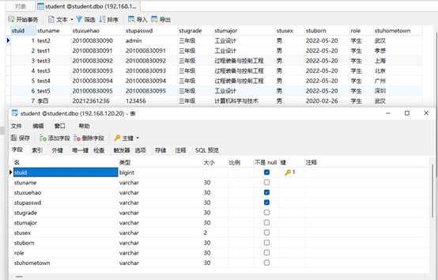
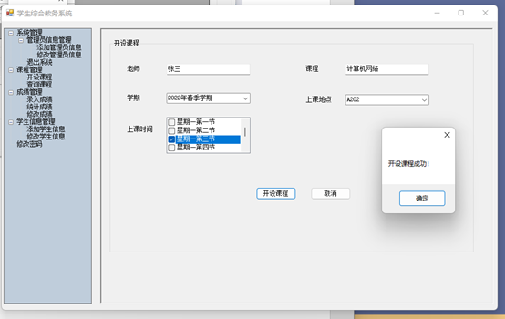

# 基于C# Windows窗体的 教务系统 学生信息管理系统 学生成绩管理系统 学生选课系统，C# + SQL Server

# 1   系统功能描述

本系统包括两类用户：学生、管理员。管理员可以通过系统来添加管理员信息、修改管理员信息、添加学生信息、修改学生信息；开设课程、查询课程、录入成绩、统计成绩、修改成绩、修改个人密码等，而学生则可以通过系统来选择课程、查询课程、显示自己的课表、查询自己的成绩单、修改个人密码等等。

## 1.1  系统功能流程

​                           

## 1.1  管理员角色拥有的功能

- ## 1.1  管理员角色拥有的功能

  l 管理员信息管理

  Ø 添加管理员信息；

  Ø 管理员可以添加其他的管理员信息。

  Ø 修改管理员信息；

  Ø 管理员可以删除其他的管理员信息。

  l 学生信息管理

  Ø 添加学生信息；

  Ø 管理员可以添加学生信息，这些信息包括学生的学号，密码，年级，专业，出生日期等等。

  Ø 修改学生信息；

  Ø 管理员可以修改学生的信息；

  l 课程管理

  Ø 开设课程；

  Ø 管理员可以录入课程信息，学生就可以浏览到这些课程信息，从而选课。

  Ø 查询课程；

  Ø 可以通过学期查询课程，或通过学期和课程结合的方式查询课程。

  l 成绩管理

  Ø 录入成绩；

  Ø 管理员可以录入学生的成绩。

  Ø 统计成绩；

  Ø 管理员可以通过学期和课程信息来统计某门课的学生成绩，平均分、最高分、最低分以及可以通过成绩区间来查询某个学期某门课的学生的成绩信息。并且可以实现排序功能。

  l 修改成绩；

  Ø 管理员可以对成绩出错的学生的成绩进行修改。

  l 修改个人密码；

  l 管理员可以修改自己的密码。

  ## 1.2  学生角色拥有的功能

  l 课程管理

  Ø 选择课程；

  Ø 学生可以根据本学期管理员发布的课程来选课。

  Ø 查询课程；

  Ø 可以通过学期查询课程，或通过学期和课程结合的方式查询课程。

  Ø 显示课表；

  Ø 学生可以根据自己的选课情况来查询自己的课表。

  l 成绩管理

  l 我的成绩单；

  l 学生可以根据学期来查询自己某个学期所有选修课程的成绩信息。

  l 修改个人密码；

  l 学生可以修改自己的密码。。

# 2 系统所用数据库说明

## 2.1  ER图

​                            

## 2.1  数据表的结构设计

### 2.1.1 班级表

​                                

### 2.1.2 管理员表

 

  

### 2.1.3 选课和成绩表

  

### 2.1.4 排课时间表

 

 

### 2.1.5 学生表

  

# 3   功能模块运行界面截图

## 3.1  管理员端

#### 3.1.1.1 用户登录

​                                .  

### 3.1.2 管理员首页

#### 3.1.2.1 修改管理员信息

 

  

#### 3.1.2.2 添加管理员

 

  

#### 3.1.2.3 修改管理员密码信息

  

  

#### 3.1.2.4 删除管理员信息

  

### 3.1.3 课程管理

#### 3.1.3.1 开设课程

 

  

#### 3.1.3.2 查询开设的课程

  

  

### 3.1.4 学生信息管理

#### 3.1.4.1 添加学生

 

  

#### 3.1.4.2 修改学生信息

  

### 3.1.5 成绩管理

  

#### 3.1.5.1 录入成绩（学生端,学生选课后,可录入）

  

  

  

  

#### 3.1.5.2 统计学生成绩

  

  

#### 3.1.5.3 修改学生成绩

  .

## 3.2  学生端

### 3.2.1 使用学生角色登录

  

### 3.2.2 学生首页

  

### 3.2.3 课程管理

#### 3.2.3.1 学生选课

  

  

  

  

#### 3.2.3.2 学生查询所选课程

  

#### 3.2.3.3 学生查询课表

  

### 3.2.4 成绩管理

#### 3.2.4.1 我的成绩单

  

### 3.2.5 学生修改密码

  

 

# 4   总结

通过本次实验我学会使用C#进行单页面的Windows窗体应用开发，在开发过程中大量使用到treeview组件，使用treeview实现点击不同的选项，在右侧面板中显示不同的界面。并且在其他的窗口得到在登录窗口输入的信息，在loginFram中设置两个方法，在其他类中只需要引用loginFram的这些方法即可。管理员开设课程时，对于同一时间该教室有课的情况做出异常处理。学生选择课程时，对选择一门课程与已选择的课程出现上课时间冲突的情况的异常处理。

 